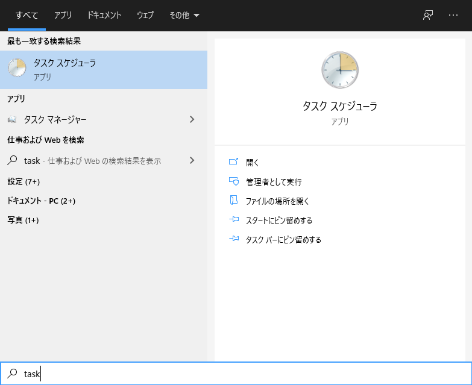

# Tailscale on WSL2

- Tasks on WSL2

  1. Install Tailscale on WSL2 (Ubuntu 20.04)

     ```shell
     curl -fsSL https://pkgs.tailscale.com/stable/ubuntu/focal.gpg | sudo apt-key add -
     curl -fsSL https://pkgs.tailscale.com/stable/ubuntu/focal.list | sudo tee /etc/apt/sources.list.d/tailscale.list
     sudo apt-get update
     sudo apt-get install tailscale
     ```

  1. Start Tailscale daemon

     ```shell
     sudo tailscaled
     ```

  1. Let WSL2 to join the Tailscale network

     ```shell
     sudo tailscale up
     ```

- Tasks on Windows 10

  1. Configure Task Scheduler to start Tailscale on statrup

     1. open Task Scheduler

        

     1. click `Create Task`

        

     1. click `Triggers`

        

     1. click `New`

        

     1. click `Begin the Task`

        

     1. select `At log on`

        

     1. save the Trigger

        

     1. click `Actions`

        

     1. click `New`

        

     1. create and save a new `Action`

        

        - Program/script:
          - `wsl` or `C:\Windows\System32\wsl.exe`
        - Add arguments:
          - `-u root tailscaled` or `-u root /usr/sbin/tailscaled`

        

     1. click `General`

        

     1. configure the task settings

        - Name:
          - any name you would like
        - Security options
          - select `Run whether user in logged on or not`
          - check `Run with highest privileges`
        - Hidden:
          - check `Hidden`
        - Configure for:
          - select `Windows 10`

        

     1. Done!

        
